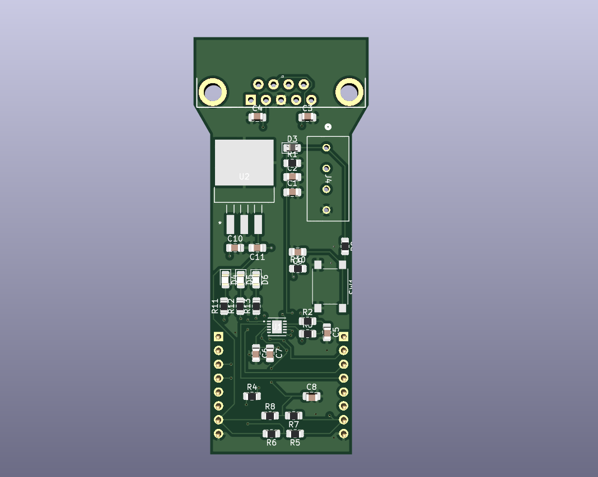

# ATA6503 MikroBUS Transceiver

## Introduction
The **ATA6503 MikroBUS** module is designed to convert standard **CAN TX** and **CAN RX** lines into **CANL** and **CANH** lines. It uses the **ATA6503** IC, securely mounted on a custom PCB. This module is extremely useful for CAN protocol-based projects where an external transceiver is required.  
For more technical specifications, please refer to the **Features** section below.

---

## Features
- **Voltage Compatibility**: Supports operation at both **3.3V** and **5V**. (A **3.3V LDO** is used for voltage conversion.)
- **Wake-Up Button**: Easily wake the device from sleep mode.
- **Three-Color LEDs**: Status indicators for quick diagnostics.
- **DB9 Connector**: Standard DB9 port for CAN network connection.
- **Screwed Connectors**: Dedicated screw terminals for secure battery connection.

---

## Fabrication Notice
This device has **not yet been fabricated**.  
Before proceeding with PCB manufacturing, **please review the schematic carefully** to ensure all design requirements are met.

---

## Known Issues
- **Impedance Matching**:  
  Proper impedance matching (typically 120Ω termination resistors) has **not been incorporated** in the current design.  
  If your application requires strict impedance control, it is recommended to **add extra components** close to the **CANL** and **CANH** lines.

---

## Contact Information
- **Name**: Gokulrajaram A
- **Email**: gokulrajarama@gmail.com
- **Phone**: +91 90259 38745

---

## PCB Preview

